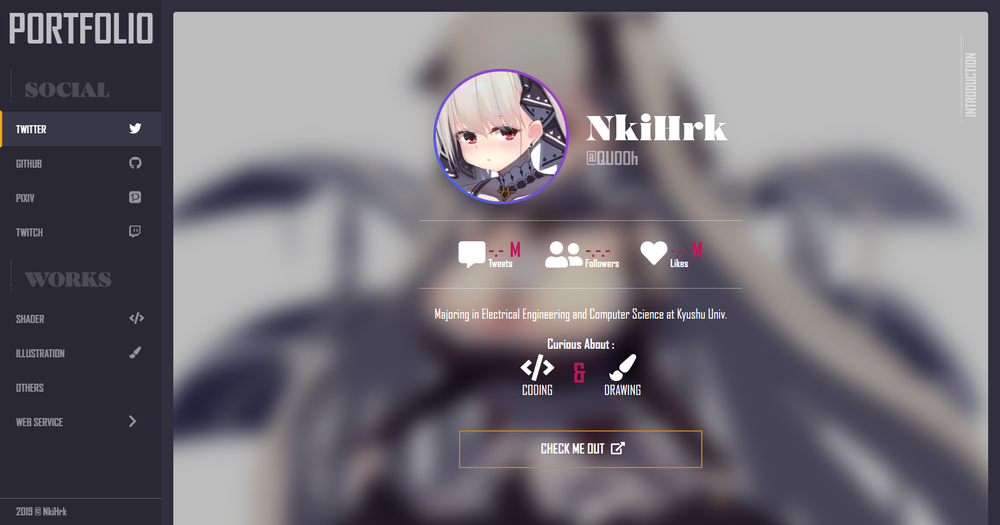
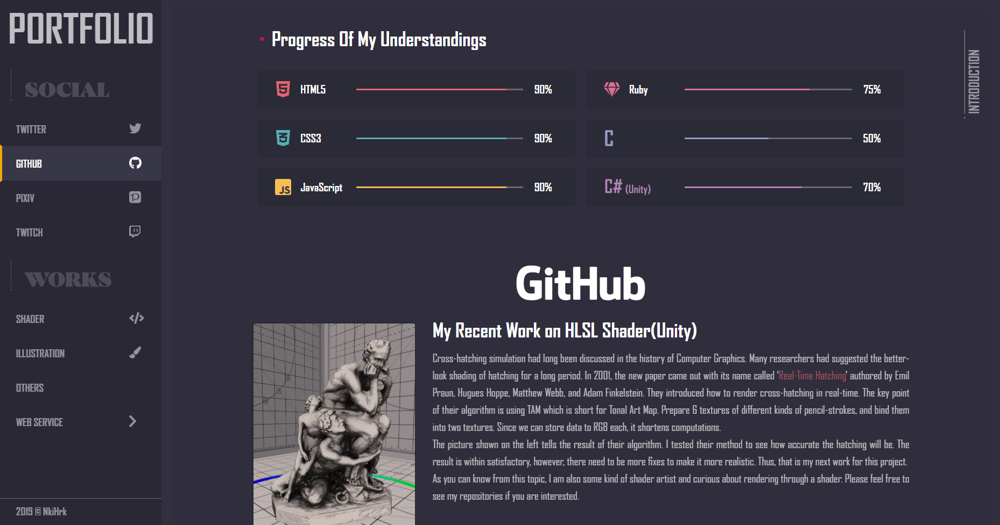
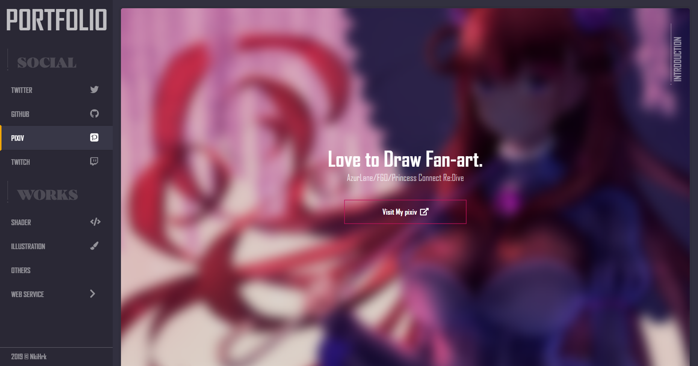
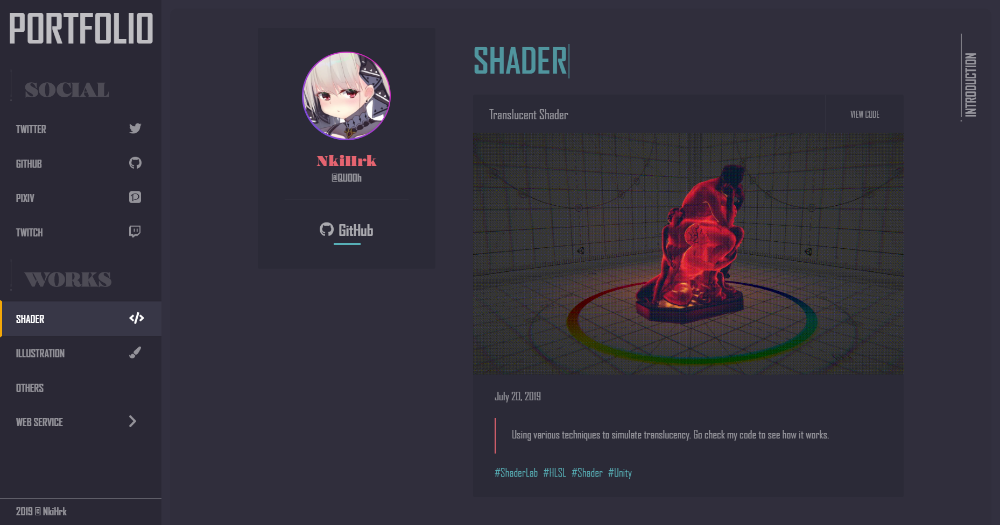
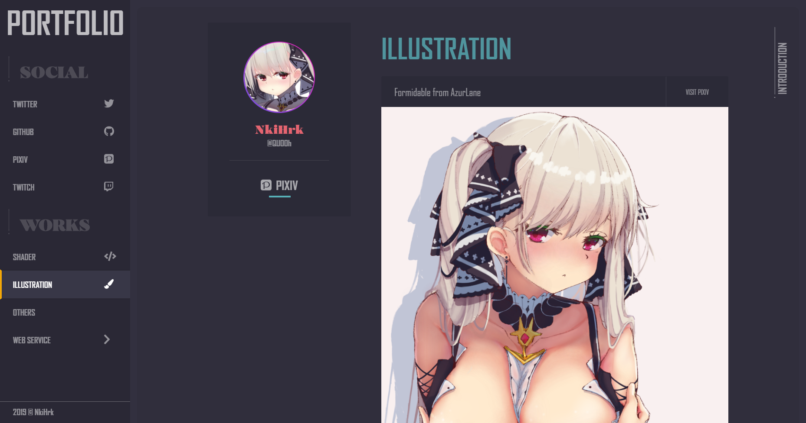
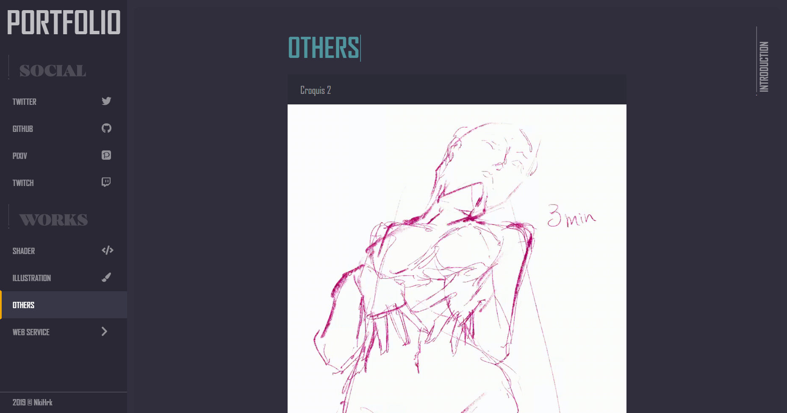
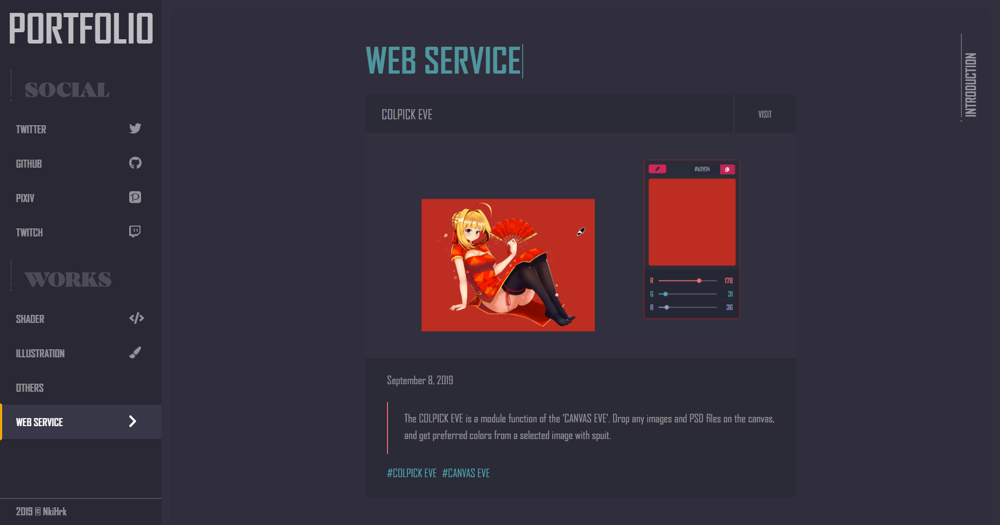

# My First Try Portfolio

It was for the first time attemptting to make my own portfolio. Fully optimized for modern browsers including Chrome, Firefox, Safari, and Vivaldi. Also mobile devices friendly, I guess. 
I'm currently working on a new one using Vue.js for better understanding of modern web dev.  

<a href="https://nkihrk.github.io/"><b>DEMO</b></a>

